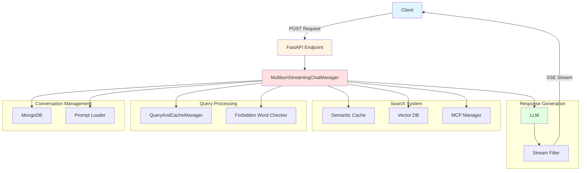
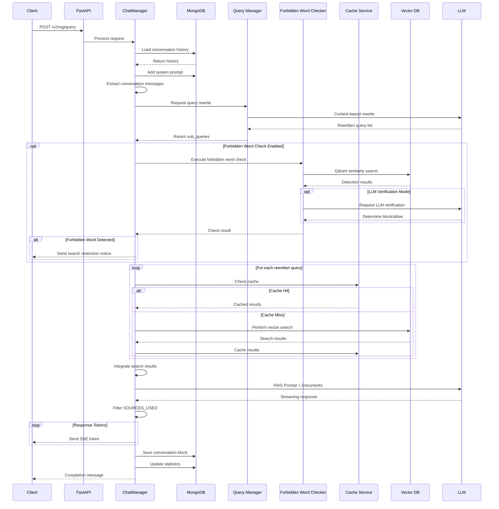
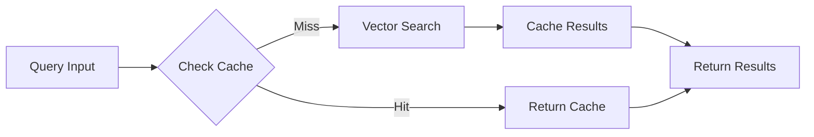
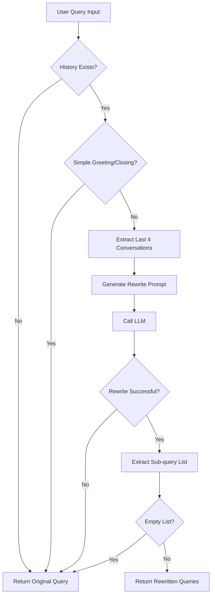
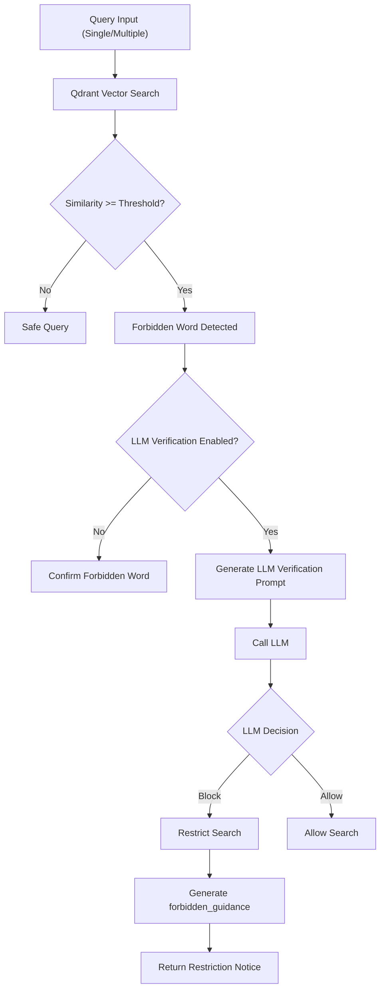
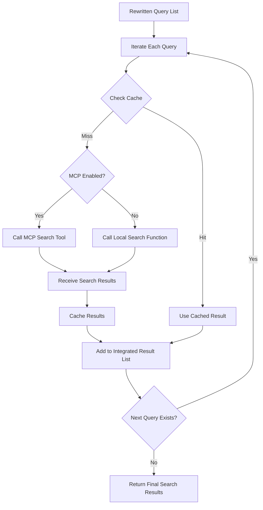
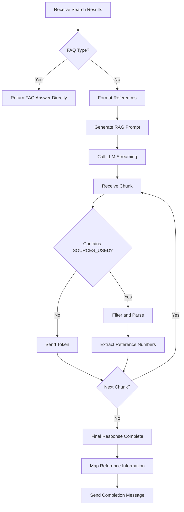
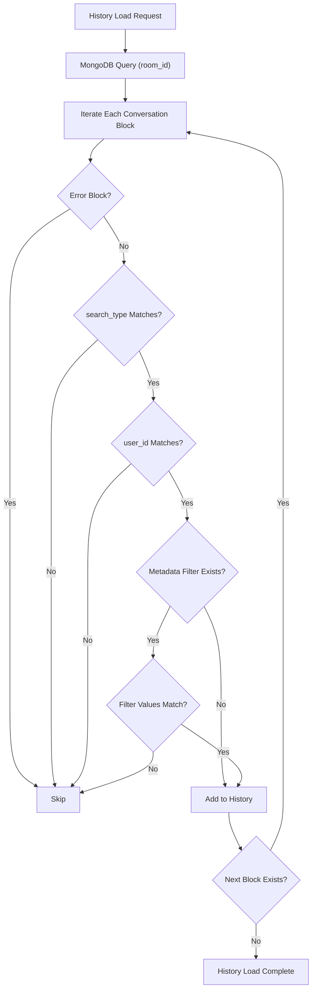
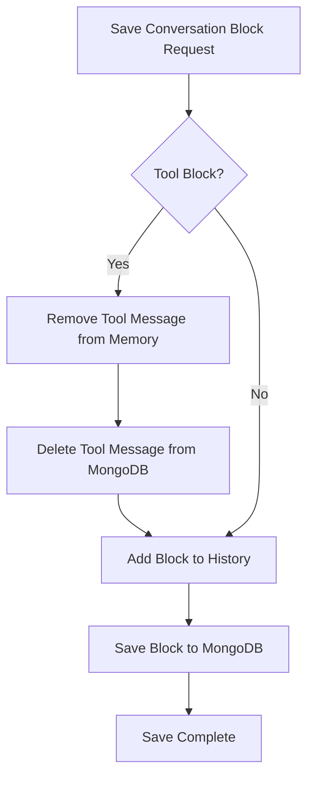

# RAG Query/Response Process Design Document(source managed in private repos)

## 1. Overview

This document describes the RAG (Retrieval-Augmented Generation) query/response process of the chat-core system.
This system provides a pipeline that finds relevant documents for user queries via Vector DB search and generates answers using an LLM.

### 1.1 Key Features

- **Multi-turn Conversation Support**: Context-based responses by saving conversation history in MongoDB.
- **Query Rewriting**: Rewriting queries as standalone questions considering the conversation context.
- **Semantic Caching**: Performance optimization through caching search results.
- **Forbidden Word Check**: Security policy-based query filtering.
- **Streaming Response**: Real-time response via Server-Sent Events (SSE).
- **MCP Integration**: Support for external tool calls (optional).

## 2. System Architecture



## 3. Overall Process Flow



## 4. Core Components

### 4.1 MultiturnStreamingChatManager

The core class that manages conversation sessions.

**Key Responsibilities:**
- Conversation history management (MongoDB)
- System prompt loading (Redis → MongoDB → File)
- Query rewriting and search execution
- LLM response generation and streaming
- Statistics collection

**Key Methods:**

| Method | Description |
| --- | --- |
| `__init__` | Session initialization, OpenAI client and DB connection setup |
| `add_room_system_prompt` | Add system prompt to the chat room |
| `get_history` | Load conversation history from MongoDB |
| `stream_response_with_openai_streaming_RAG` | Generate RAG streaming response (Main process) |
| `search_documents` | Execute document search (Rewriting, forbidden word check, vector search) |
| `execute_tool_call` | Execute tool call (local_search, MCP, etc.) |
| `filter_streaming_sources_used_realtime` | Filter SOURCES_USED marker |
| `statistics` | Save token usage statistics |

### 4.2 QueryAndCacheManager

The class responsible for rewriting queries.

**Features:**
- Context-aware query rewriting
- Utilizes the last 4 conversation histories
- Generates a standalone question or a list of sub-queries

**Prompt Template:** `rewrite_query` (Loaded from Redis/MongoDB/File)

**Rewrite Example:**
- Input: "Who is he?" (Previous history: "Tell me about Chul-soo Kim")
- Output: `["Who is Chul-soo Kim?"]`

### 4.3 Forbidden Word Check System

**2-Step Verification Process:**

1. **Qdrant Vector Search**
   - Similarity search within the forbidden word collection
   - Detects forbidden words when above the threshold (default 0.3)
   - Match types: exact (0.95+), synonym (0.80+), contextual (0.50+)

2. **LLM Verification** (Optional, `forbidden_check_mode=llm`)
   - LLM re-verifies the Qdrant detection results
   - Block Criteria:
     - Standalone use of a forbidden word (e.g., "person", "executive")
     - Forbidden word + inquiry keyword (e.g., "Who is the executive?", "How much is the salary?")
   - Allow Criteria:
     - Forbidden word + procedure/method keyword (e.g., "Executive appointment procedure", "How to apply for salary")
     - False positive (Only morphological match, different context)

**Behavior upon Detection:**
- Blocks the search
- Generates a `forbidden_guidance` message
- Sends a restriction notice to the client

### 4.4 Semantic Caching

**CacheServiceClient:**
- Communicates with the KDB Manager's cache API
- Caches search results based on vector similarity
- Cache hits for identical or similar questions

**Operation Flow:**


### 4.5 Vector Search (RAG Retriever)

**neural_search_rerank_paragraph_v1:**
- Calls KDB API `/api/v1/document/search_rerank`
- Parameters:
  - `collection_name`: Collection name
  - `query`: Search query
  - `use_paragraph`: Whether to search by paragraph
  - `metadata_filter_key`: Metadata filter key
  - `match_values`: List of filter values
  - `top_k`: Maximum number of search results (default 100)

**Search Result Format:**
```json
[
  {
    "p_id": "paragraph_id",
    "context": "Document content",
    "score": 0.85,
    "metadatas": {
      "file_name": "DocumentName.pdf",
      "class": "Category",
      "paragraph_type": "normal"
    }
  }
]
```

### 4.6 LLM Response Generation

**RAG Prompt Structure:**
```
[System Prompt]
<system message>

[User Query]
Please answer the question using the references below.

[References]
Reference [1] : [Document Name]
<Document Content>

Reference [2] : [Document Name]
<Document Content>

[Question]
<user query>
```

**Streaming Processing:**
- OpenAI API `stream=True` mode
- Responses in SSE (Server-Sent Events) format
- Filters out the `SOURCES_USED:` marker

## 5. Data Models

### 5.1 SessionChatRequest

Client request model:

```python
{
  "collection_name": str,      # Vector DB collection
  "query": str,                # User query
  "room_id": str,              # Chat room ID
  "user_id": str,              # User ID
  "search_type": str,          # "rag" | "gpt" | "pa"
  "mcp_org": str,              # MCP organization (default "GO_RAG")
  "use_paragraph": bool,       # Use paragraph search
  "metadata_filter_key": str,  # Metadata filter key
  "metadata_filter_values": List[str],  # Filter values
  "top_k": int,                # Number of search results (default 100)
  "temperature": float,        # LLM temperature (default 0.2)
  "is_test": bool              # Test mode
}
```

### 5.2 conversationBlock

Conversation block (Saved in MongoDB):

```python
{
  "version": "v3",
  "status": "done" | "error" | "idle",
  "block_classes": List[str],   # Filter classes
  "search_type": "rag" | "gpt" | "pa",
  "conversations": [
    {
      "role": "user" | "assistant" | "system" | "tool",
      "content": str,
      "tool_calls": List[tool],
      "tool_call_id": str,
      "name": str,
      "created_at": str (ISO 8601)
    }
  ],
  "room_id": str,
  "chat_id": str,
  "user_id": str,
  "is_tool_block": bool,
  "is_error": bool,
  "result": {
    "type": "done" | "error",
    "final_response": str,
    "references": List[dict],
    "usage": {
      "prompt_tokens": int,
      "completion_tokens": int,
      "total_tokens": int
    },
    "search_decision": {
      "rewritten_query": List[str]
    }
  }
}
```

## 6. SSE Response Format

### 6.1 Event Types

| Type | Description | Example |
| --- | --- | --- |
| `step` | Process step | `{"type": "step", "id": "uuid", "content": "Searching for relevant documents..."}` |
| `debug` | Debug info | `{"type": "debug", "id": "uuid", "content": "Query rewriting complete"}` |
| `think` | Reasoning content | `{"type": "think", "id": "uuid", "content": "Thinking..."}` |
| `token` | Response token | `{"type": "token", "content": "Hello"}` |
| `done` | Completion | `{"type": "done", "final_response": "...", "usage": {...}, "references": [...]}` |
| `error` | Error | `{"type": "error", "content": "Error message", "detail": "..."}` |

### 6.2 Stream Example

```
data: {"type": "step", "id": "...", "content": "Understanding the intent of the user's question..."}

data: {"type": "debug", "id": "...", "content": "Query rewriting complete: \"What is a RAG system?\""}

data: {"type": "step", "id": "...", "content": "Searching for relevant documents..."}

data: {"type": "step", "id": "...", "content": "Generating an answer..."}

data: {"type": "token", "content": "The "}

data: {"type": "token", "content": "RAG system"}

...

data: {"type": "done", "search_type": "rag", "final_response": "...", "usage": {...}, "references": [...]}
```

## 7. Detailed Processes

### 7.1 Query Rewriting Process



**Rewrite Prompt Structure:**
```
[Conversation History]
user: Previous Question 1
assistant: Previous Answer 1
user: Previous Question 2
assistant: Previous Answer 2

[Current Question]
<user query>

[Instructions]
Considering the conversation context above, rewrite the current question into a standalone question.
If necessary, break it down into multiple sub-queries.

Response Format:
{"queries": ["Rewritten Query 1", "Rewritten Query 2", ...]}
```

### 7.2 Forbidden Word Check Process



**LLM Verification Logic:**

1. **Step 1: Verify Qdrant Detection**
   - Check for false positives (extremely limited)
   - Block Decision:
     - Standalone use of a forbidden word
     - Forbidden word + inquiry keyword
   - Allow Decision:
     - Forbidden word + procedure/method keyword

2. **Step 2: Verify Personal Sensitive Information** (If Step 1 passes)
   - Block Patterns:
     - Possessive + sensitive info inquiry
     - Standalone sensitive info inquiry
   - Allow Patterns:
     - Sensitive info + method/procedure inquiry

### 7.3 Search Execution Process



**Determining the Search Tool:**
- If MCP is connected: MCP tools like `neural_search`
- If MCP is not connected: `local_search` (Built-in function)

**Automatic Injection of Search Parameters:**
```python
{
  "query": "Rewritten query",
  "collection_name": "Session collection",
  "metadata_filter_key": "Session filter key",
  "match_values": "Session filter values",
  "top_k": "Session top_k",
  "use_paragraph": "Session setting"
}
```

### 7.4 Response Generation Process



**Parsing SOURCES_USED:**
```
LLM Response: "...Answer content... SOURCES_USED: 1, 3, 5"
```
- Filtering: "...Answer content..." (Sent to client)
- Parsing: `[1, 3, 5]` (Reference numbers)
- Mapping: Includes documents at indices 1, 3, 5 from the search result list into `references`

## 8. Conversation History Management

### 8.1 History Load Logic



**Filtering Conditions:**
- `is_error == False`
- `search_type` matches (rag/gpt/pa)
- `user_id` matches
- `metadata_filter_values` is empty, or has an intersection with the block's `block_classes`

### 8.2 History Save Logic



**Tool Block Processing:**
- Removes `assistant` messages with `role=tool` and `tool_calls` from `history` in memory
- Similarly removes them from MongoDB using the `$pull` operator
- Keeps only the final assistant response

## 9. Statistics and Monitoring

### 9.1 Token Usage Aggregation

```python
{
  "prompt_tokens": int,       # Prompt tokens
  "completion_tokens": int,   # Response tokens
  "total_tokens": int         # Total tokens
}
```

**Accumulation Points:**
1. LLM call for query rewriting
2. LLM verification call for forbidden words (Optional)
3. LLM call for RAG response generation

### 9.2 Statistics Storage (MongoDB)

**Collection:** `{STATISTIC_DB}.{search_type}`

**Document Structure:**
```python
{
  "user_id": str,
  "room_id": str,
  "date": str,           # YYYY-MM-DD
  "model": str,          # rag/gpt/pa
  "usage": {
    "prompt_tokens": int,
    "completion_tokens": int,
    "total_tokens": int,
    "type": "usage"
  }
}
```

**Update Method:**
- Prevents duplicates per day (`upsert`)
- Updates `usage` for the same date/user/room/model

## 10. Configuration and Environment Variables

### 10.1 Main Configurations

| Category | Setting | Environment Variable | Default Value | Description |
| --- | --- | --- | --- | --- |
| LLM | Base URL | `LLM__BASE_URL` | `http://10.10.1.60:10222/v1` | LLM API Endpoint |
| LLM | Model | `LLM__MODEL` | `openai/gpt-oss-120b` | LLM Model Name |
| LLM | Temperature | `LLM__TEMPERATURE` | `0.2` | Response Diversity |
| LLM | Max Tokens | `LLM__MAX_COMPLETION_TOKENS` | `10000` | Maximum Response Tokens |
| RAG | Forbidden Check Enabled | `RAG__FORBIDDEN_CHECK_ENABLED` | `true` | Whether to use forbidden word check |
| RAG | Forbidden Threshold | `RAG__FORBIDDEN_CHECK_THRESHOLD` | `0.3` | Similarity threshold (0.0~1.0) |
| RAG | Forbidden Check Mode | `RAG__FORBIDDEN_CHECK_MODE` | `llm` | `llm` or `qdrant` |
| KDB | URL | `KDB__URL` | `http://10.30.1.196:28101` | Vector DB API Endpoint |
| MCP | Gateway | `MCP__GATEWAY` | `http://10.10.1.25:8502` | MCP Gateway |
| MCP | Enabled | `MCP__MCP_ENABLED` | `false` | Whether to use MCP |
| DB | Host | `DB__HOST` | `10.30.1.196` | MongoDB Host |
| DB | Port | `DB__PORT` | `27017` | MongoDB Port |

## 11. Error Handling

### 11.1 Error Types

| Error Situation | Handling Method |
| --- | --- |
| LLM API Error | Sends SSE `error` event, includes error details |
| Vector DB Connection Error | Fallback to local search (404: Returns empty result) |
| Cache Service Error | Logs and skips caching, continues search |
| Forbidden Word Check Error | System error notice, blocks search |
| MongoDB Connection Error | FastAPI 500 Error Response |
| MCP Connection Failure | Fallback to local search |
| Query Rewrite Failure | Uses original query |

### 11.2 Error Response Format

**Error During Streaming:**
```json
{
  "type": "error",
  "content": "An error occurred: <error message>",
  "detail": "<traceback>",
  "final_response": "<partial response>",
  "usage": {
    "prompt_tokens": 0,
    "completion_tokens": 0,
    "total_tokens": 0
  }
}
```

**Error Before Streaming:**
```json
{
  "type": "error",
  "content": "A server error occurred: <error message>",
  "detail": "<traceback>"
}
```

## 12. API Endpoints

### 12.1 POST /v2/rag/query

RAG Query/Response API (Streaming)

**Request:**
```json
{
  "collection_name": "kac_law",
  "query": "What is Article 1 of the Aviation Act?",
  "room_id": "room_123",
  "user_id": "user_456",
  "search_type": "rag",
  "metadata_filter_key": "class",
  "metadata_filter_values": ["Law", "Regulation"],
  "top_k": 100,
  "temperature": 0.2
}
```

**Response:** SSE Stream
```
data: {"type": "step", "id": "...", "content": "..."}

data: {"type": "token", "content": "..."}

data: {"type": "done", "final_response": "...", "usage": {...}, "references": [...]}
```

### 12.2 POST /v2/gpt/query

GPT Query/Response API (No RAG)

**Same Request Format**

**Differences:**
- No vector search
- Uses only conversation history
- Uses `stream_response_with_openai_streaming_GPT`

### 12.3 POST /v2/pa/query

PA (Planning Agent) Query/Response API

**Same Request Format**

**Differences:**
- MCP connection enabled
- Can use external tools
- RAG + MCP integration mode

### 12.4 GET /v2/{search_type}/query

Retrieves accumulated token count for the current chat room

**Query Parameters:**
- `room_id`: Chat room ID
- `user_id`: User ID

**Response:**
```json
{
  "tokens": 1234
}
```

## 13. Performance Optimization

### 13.1 Caching Strategy

1. **Semantic Cache**
   - Vector similarity-based caching
   - Reuses search results for identical/similar queries
   - TTL: 15 minutes (KDB Cache Service setting)

2. **Prompt Cache**
   - Redis → MongoDB → File hierarchical structure
   - Caches system prompts and RAG templates

### 13.2 Parallel Processing

1. **Multiple Query Search**
   - Sequentially processes multiple rewritten queries
   - Integrates each search result

2. **Parallel Forbidden Word Checking**
   - Parallel execution of Qdrant searches for multiple queries
   - Utilizes `aiohttp.ClientSession`

### 13.3 Streaming Optimization

1. **Chunk-Level Transmission**
   - Token-level streaming via SSE
   - Enables client real-time rendering

2. **Buffer Management**
   - Maintains a maximum 30-character tail buffer when filtering SOURCES_USED
   - Memory-efficient processing

## 14. Security Considerations

### 14.1 Forbidden Word Check

- Blocks sensitive information inquiries
- Filters terms restricted for business use
- Precision blocking through LLM verification

### 14.2 Data Isolation

- History filtering based on `user_id`
- Chat room isolation based on `room_id`
- Document access control based on `metadata_filter_values`

### 14.3 Authentication/Authorization

- API level authentication (Requires implementation)
- User-specific collection access rights management
- Statistics information access control

## 15. Scalability

### 15.1 MCP Integration

- External tool integration (Search, calculation, files, etc.)
- Dynamic tool loading
- Automatic injection of search parameters

### 15.2 Multi-modal Support

- Vision API integration (Separate endpoint)
- Image-based query and response
- Utilization of VLM models

### 15.3 Various Search Modes

- Hybrid search (Vector + BM25)
- Graph search (Knowledge Graph)
- VOC search (Voice of Customer)

## 16. Appendix

### 16.1 Main Directory Structure

```
chat-core/
├── routes/v2/
│   └── query.py                # API Endpoints
├── utils/
│   ├── query_cache_manager.py  # Query Rewriting & Cache Client
│   └── multimcpmanager.py      # MCP Integrated Management
├── tools/
│   ├── rag_retriever.py        # Vector Search Function
│   └── forbidden_words_checker.py  # Forbidden Word Check
├── prompts/
│   └── __init__.py             # Prompt Loader
├── models/
│   └── __init__.py             # Pydantic Models
├── config/
│   └── __init__.py             # Configuration Management
└── global_variables.py         # Global Variables
```
